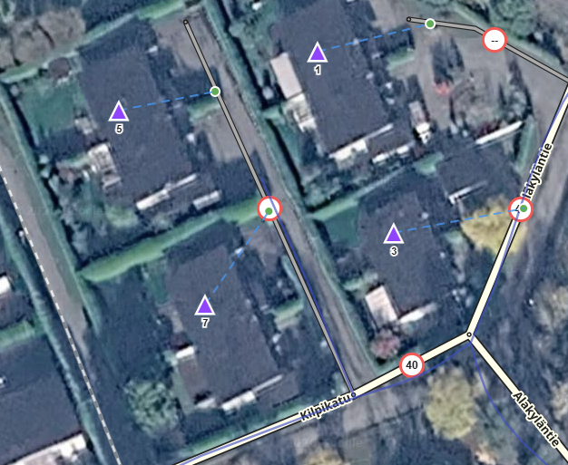

# WME RPP Visualizer

A Waze Map Editor (WME) userscript that visualizes Residential Point Places (RPPs) directly on the map. Shows street number labels, entry point indicators, and connection lines without requiring you to select each RPP individually.

## Features

- **Street number labels** — house numbers displayed above RPP points at configurable zoom levels
- **Entry point dots** — green circle markers at each entry/exit point
- **Connection lines** — dashed blue lines connecting RPP centers to their entry points
- **Road connection lines** — dashed orange lines from entry points to nearest road segment (fallback: from RPP marker directly if no entry points exist)
- **Zoom thresholds** — independently configurable minimum zoom levels for labels vs. lines/dots
- **Sidebar panel** — toggle and settings via the standard WME sidebar ("RPP" tab)
- **Settings persistence** — all preferences saved to localStorage

## Installation

Install from [Greasy Fork](https://greasyfork.org/en/scripts/586509-wme-rpp-visualizer) — this is the primary source for updates. The script auto-updates via your userscript manager (Tampermonkey or Violentmonkey).

## Manual Setup

1. Install a userscript manager (Tampermonkey or Violentmonkey)
2. Create a new script and paste the contents of `WME_RPP_Visualizer.js`
3. Save and ensure the script is enabled
4. Open the [Waze Map Editor](https://www.waze.com/en/editor)

## Usage

1. Open the **RPP** sidebar tab in WME
2. Check **Show RPP Info** to enable the visualization
3. Adjust zoom thresholds as needed:
   - **Show labels zoom** — minimum zoom level for street number labels (default: 17)
   - **Show lines zoom** — minimum zoom level for entry dots and connection lines (default: 18)

Labels and lines automatically appear/disappear as you pan and zoom the map.

### Line Legend

| Line | Meaning |
|------|---------|
| Blue dashed (`#2196F3`) | RPP center → entry/exit point |
| Orange dashed (`#FF9800`) | Entry point → nearest point on road segment |
| Orange dashed (fallback) | RPP center → nearest road (drawn when RPP has no entry points) |
| Orange dot | Closest point on road segment |

## Changelog

### 1.1.0

- Orange road connection lines from entry points to nearest road segment
- Fallback orange line from RPP marker to nearest road when no entry points exist
- Orange dot at road endpoint

### 1.0.0

- Initial release
- Street number labels on RPP points
- Entry point dot markers
- Connection lines between RPP centers and entry points
- Zoom-dependent visibility with configurable thresholds
- Sidebar panel with enable toggle, zoom settings, visible count, and debug option
- Settings persistence via localStorage
